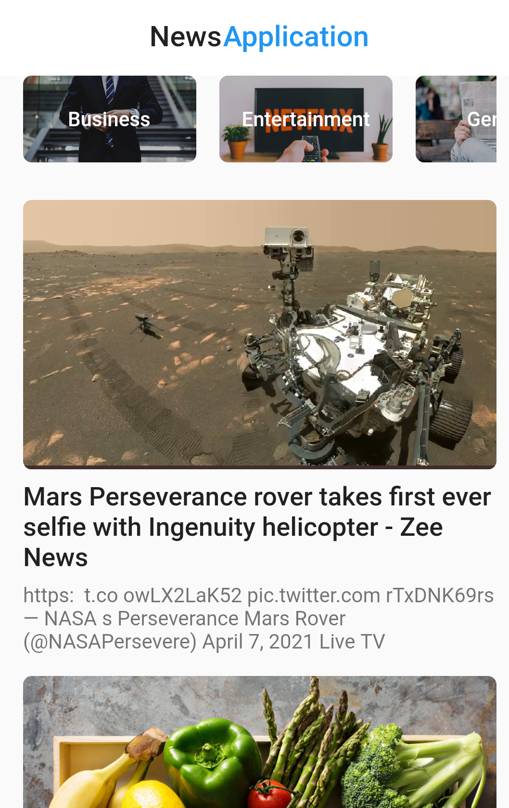

# News Application
News application using the API from https://newsapi.org/

App Link https://drive.google.com/file/d/1VBvYpNoyq0FwF7OTtTno77uAYsNRQNN1/view?usp=sharing

News App is a simple news app 🗞️ which uses NewsAPI to fetch top news headlines from the API. The main aim of this app is to be a leading example of how to build Modern Android applications for all Android Developers

API News Is JSON API for live news and blog articles from the media.

 
 
 

